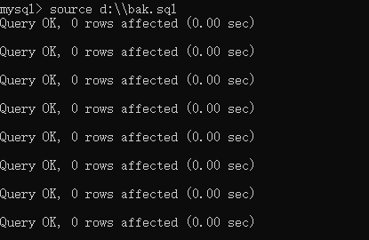

## MySQL5.7 安装配置

下载地址

> http://dev.mysql.com/get/Downloads/MySQL-5.7/mysql-5.7.19-winx64.zip

添加环境变量

​	在Path中添加mysql的bin目录所在的绝对路径


在mysql目录中新建一个my.ini文件，输入如下指令

```xml
[client]
port=3306
default-character-set=utf8
[mysqld]
# 设置为mysql的安装目录
basedir=D:\mysql-5.7.19-winx64\mysql-5.7.19-winx64\
# 设置为mysql的数据目录
basedir=D:\mysql-5.7.19-winx64\mysql-5.7.19-winx64\data\
port=3306
character_set_server=utf8
# 跳过安全检查
skip-grant-tables
```

使用管理员身份打开cmd，并切换到mysql的bin目录下，执行mysqld -install指令


初始化数据库：mysqld --initialize-insecure --user=mysql


初始化成功后会生成刚才在my.ini中设置的data文件夹


启动mysql服务：net start mysql

停止mysql服务：net stop mysql


进入mysql管理终端：mysql -u root -p 	//-u root指root用户，-p指密码，因为初始没有密码，所以为空，输入指令后要求输入密码时回车即可


修改root用户密码

use mysql;	//使用mysql数据库

update user set authentication_string=password('000') where user='root' and Host='localhost';	//依次为密码000，用户root和本地登录

flush privileges;	//刷新权限

quit;	//退出，退出不代表会关闭mysql服务


修改my.ini，再次进入就会进行权限验证了

```xml
#skip-grant-tables
```


## 命令行连接到MySQL

命令

> mysql -h 主机IP -P 端口号 -u 用户名 -p密码


<u> 注意</u>：

* -p密码不要有空格

* -p后面没有密码，回车会要求写密码
* 如果没有-h 主机，默认就是本机
* 如果没有-P 端口号，默认就是3306


## Datagrip安装及简单使用

下载https://www.jetbrains.com/datagrip/download/#section=mac


连接数据库


第一次连接时可能需要下载对应的数据库驱动


如果测试连接没有成功，根据提示检查配置，是用户名密码问题还是没有启动对应的数据库服务

连接成功后，并未展示所有的数据库，可根据需要设置


常用快捷键

​	ctrl+shift+u 大小写转换

​	ctrl+alt+L sql格式化

​	ctrl+enter 执行sql查看sql历史：有时候在写完sql后，会将sql删掉，但后来又要再次使用，那么datagrip和IDEA等开发工具一样能查看历史记录，在空白处，右键---》Local History--》Show History


## MySQL的三层结构

所谓安装mysql数据库，就是在主机安装一个数据库管理系统（DBMS），这个管理程序可以管理多个数据库

一个数据库中可以创建多个表，用以保存数据


例：通过Datagrip运行一条指令，通过端口传给对应的数据库，DBMS会对这条指令进行解析，并把执行结果返回

mysql数据库-普通表的本质是文件，数据库在数据库安装文件夹下的data文件夹中


## SQL语句分类

DDL：数据定义语言[create表，库...]

DML：数据操作语言[增删改]

DQL：数据查询语言[查询]

DCL：数据控制语言[管理数据库，比如用户权限]


## mysql的数据类型

数值类型（数值类型分有符号和无符号，bit(M)除外）：

> 位类型：bit(M) M指定位数即范围，默认值1，范围1～64	当表或字段设置为bit类型时，显示按照二进制位显示，3显示为11
>
> 整形：tinyint(1 byte)
>
> ​			smallint(2 byte)
>
> ​			mediumint(3 byte)
>
> ​			int(4 byte)
>
> ​			bigint(8byte)
>
> 小数类型：float(单精度 4 byte)
>
> ​					double(双精度 8byte)
>
> ​					demical[M,D] (大小不定) M是小数位数（精度）的总数，D是小数点（标度）后面的位数，M最大65，D最大30，M被省略默认是10，D被省略默认是0，D是0则没有小数点

文本类型（字符串类型）

> char 0~255	255指的是字符，不同的字符编码中，一个字符所占的字节数不同，utf8中一个字符占三个字节
>
> varchar 0~2^16-1	
>
> * varchar(4)和char(4)指的都是可存储四个字符，而不是字节 
>
> * char(4)指的是定长，固定的大小，varchar(4)指的是变长，按照实际使用空间来分配，varchar本身还需要1～3个字节来记录内容的长度
> * 如果数据是定长的，建议使用char，比如身份证号，学号等，因为char的查询速度更快
>
> text 0~2^16-1
>
> longtext 0~2^32-1
>
> * text类型同样是变长

二进制数据类型

> blob 0~2^16-1
>
> ongblob 0~2^32-1

日期类型

> date (年 月 日)
>
> time(时 分 秒)
>
> datetime(年月日 时分秒 YYYY- MM- DD HH:mm:ss)
>
> timestamp(时间戳，可用于自动记录insert)
>
> * 如果要记录每次的修改时间，定义not null default current_timestamp on update current_timestamp
>
>   
>
> year(年)


## SQL指令操作

### 创建数据库

```sql
create database [if not exists] db_name [create_specification , ...;
```

create_specification:
character set [charset_name]
collate [collaction_name]

character set：指定数据库采用的字符集，如果不指定，默认utf8

collate：指定字符集的校对规则，常用：utf8_bin【区分大小写】，utf8_general_ci【不区分大小写】，默认是utf8_general_ci

另：在创建数据库/表时，与关键字冲突，可使用反引号

```sql
create database `create`
```

### 查看、删除数据库

```sql
#显示数据库
show databases
#显示数据库创建语句
show create database db_name
#数据库删除语句
drop database [if exists] db_name
```

### 备份恢复数据库/表

在DOS执行命令行

```shell
mysqldump -u 用户名 -p -B 数据库1 数据库2 > 文件名.sql
#例：将practice_sql数据库备份，备份放到D盘下，备份文件名命名为bak.sql
mysqldump -u root -p -B practice_sql > d:\\bak.sql
```

恢复数据库

进入mysql命令行执行

```shell
source 文件名.sql
```



备份恢复数据库的表

```shell
mysqldump -u 用户名 -p 数据库 表1 表2 表n > d:\\文件名.sql
```

另：还有一种备份恢复的方法

打开备份文件，复制全部内容，放到数据库管理软件中执行

这种方法相当于把备份的数据库的操作指令又全部执行一遍


### 创建表

```sql
create table table_name(
	field1 datatype,
	field2 datatype,
	field3 datatype
)character set字符集 collate 校对规则 engine 存储引擎
character set如不指定则为所在数据库字符集
collate如不指定则为所在数据库校对规则
```

### 修改表

```sql
#添加列
alter table table_name add column datatype [not mull default ''] after column_name;
#修改列
alter table table_name modify column_name datatype [not null default ''];
#删除列
alter table table_name drop column_name;
#表重命名
rename table table_name to new_table_name;
#修改表字符集
alter table table_name character set utf8/gdk/...;
#修改字段字符集
alter table table_name column_name new_column_name datatype character set utf8;
#修改列名
alter table table_name change column_name new_column_name datatype [not null default ''];
```

### 删除表

```sql
drop table table_name;
```


### 增删改查

insert

```sql
insert into table (column1,column2,...) values(value1,value2,...);
```

注意：

> 如果插入中文字符，字符集必须为 utf8
>
> 字符和日期型数据应包含在单引号中
>
> 列可以插入空值，前提是列允许空值
>
> insert into table_name () values(),(),()形式添加多条数据
>
> 如果是给表中所有字段添加数据，可以不写前面的字段名称

updata

```sql
update table set column=value [where ...];

例：
在salary字段的原基础上加1000
update table set salary=salary+1000
```

注意：

> 不添加where子句，是更改表中所有的相应字段值
>
> 修改多个字段值 set column1=value1,  column2=value2, ... 

delete

```sql
delete from table where column = value;
```

注意：

> 如果不是用where子句，将删除表中所有数据
>
> delete语句不能删除某一列的值，可使用update设置某一列为null或''
>
> delete语句仅删除表中记录不删除表，删除表使用drop table语句

select

```sql
select [distinct] *|column1, column2,... from table_name;
#distinct去除重复数据

select *|(column1|expression, column2|expression...) from table_name;
#表达式可以对查询的列进行运算

select column as 别名 from table
#更改列名显示
```

例：


where子句

常用运算符：

> 比较运算符：
>
> < > <= >= = <> !=
>
> between ... and ...	 显示在某一区间的值
>
> in(set)	显示在in列表中的值
>
> like '李%'	模糊查找
>
> not like ''	
>
> is null	判断是否为空
>
> 逻辑运算符：
>
> and, or, not

 ```sql
 #查询英语分数在80-90之间的学生
 select * from student where english betwen 80 and 90;
 select * from student where english >= 80 and english <= 90
 
 #查询数学成绩为89，90，91的同学
 select * from student where math in (89,90,91);
 select * from student where math = 89 or math = 90, math = 91;
 
 #查询所有姓李的学生成绩
 select * from student where name like '李%';
 
 #查询数学分>80,语文分>80的同学
 select 8 from student where math > 80 and chinese > 80
 ```

order by

```sql
select column1,column2,... from table order by column asc|desc...
```

order by指定排序的列，排序的列既可以是表中的列名，也可以是select语句后指定的列名

asc升序（默认），desc降序

order by子句应用与select语句的结尾，在where子句的后面

### 统计函数

count返回行的总数

```sql
select count(*)|count(列) from table [where ...];
```

注意：

> count(*)：返回满足条件的记录的行数
>
> count(列)：返回满足条件的某列有多少个，但是会排除为null的情况


sum函数返回满足where条件的行的和，一般使用在数值列

```sql
select sum(列),sum(列),... from table [where ...];
```


avg函数返回满足where条件的一列的平均值，一般使用在数值列

```sql
select avg(列)，avg(列),... from table [where ...]; 
```


max/min函数返回满足where条件的一列的最大值和最小值

```sql
select max(列) from table [where ...]; 
```

分组函数

group by 子句对列进行分组

```sql
select column1, column2, ... from table group by colum;

#使用having 子句对分组后的结果进行过滤
select column1, column2, ... from table group by colum having ...;
```

注意：

> group by用于对查询的结果分组统计，例如分组求平均值
>
> having子句用于限制分组显示结果
>
> 分组查询中的筛选分为两类：
>
> * 分组前筛选： 数据源来自原始表，使用where关建字，放在group by之前
>
> * 分组后筛选：数据源来自group by的结果，使用having关建字，放在group by之后统计函数做筛选条件时，一定是放在having中，能放在分组前筛选的，就优先考虑分组前筛选
>
> group by后面既可以跟字段，也可以跟表达式或者函数
> 

### 字符串函数


注意：

> instr(column, string) 返回该字段中string出现的位置
>
> replace(column, search_str, replace_str) 表中的值并不会改变，只是返回值改变了
>
> substring(column, position) 这样写的话就会从字段的position位置把后面的字符串全部返回

### 数学函数


注意：

> rand()会随机返回一个[0,1]之间的数，rand([seed])是固定这个数，以防每次的随机数不同
>
> format(num,decimal_num)是指保留num的decimal_num个小数位，四舍五入

### 日期函数


细节：

```sql
#查询十分钟内发布的信息
select * from table where date_add(column, interval 10 minute) >= now();

#只显示年,月和日以此类推
select year(now()) from table;

#unix_timestamp()返回1970-1-1到现在的秒数，from_unixtime()可以把unix_timestamp()的秒数转成指定格式的日期
select from_unixtime(unix_timestamp(), '%Y-%m-%d %H-%i-%s') from table;
```

### 加密函数


